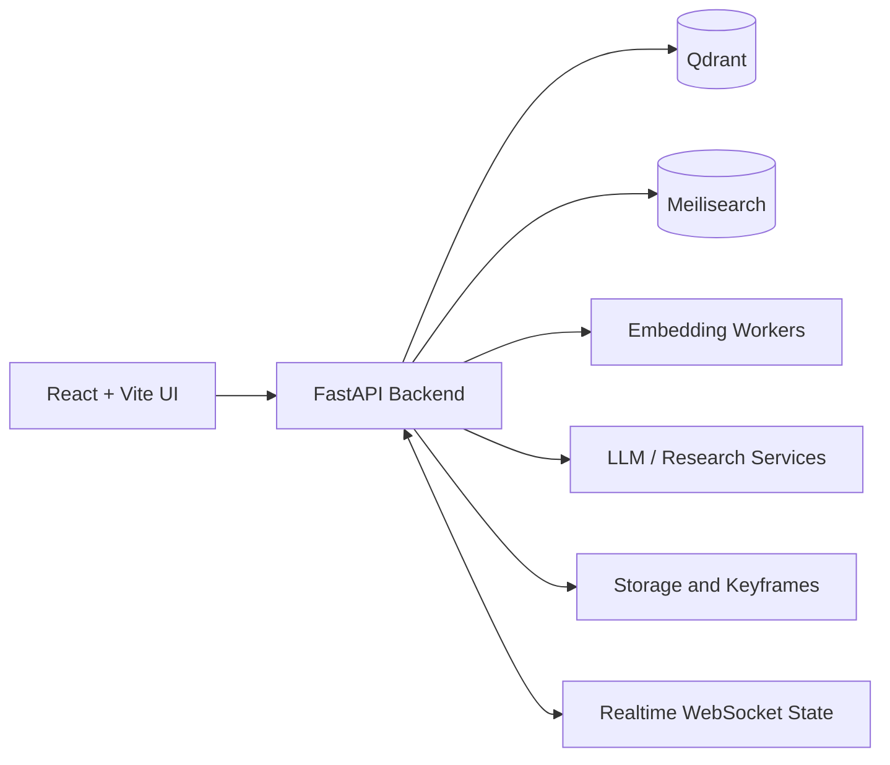

<div align="center">
  
  <h1>OpenCubee2</h1>
  <p><strong>A high-performance multimodal video retrieval workspace for AI Challenge competitions.</strong></p>
  <p>Text · Image · OCR · ASR · Temporal Search · Realtime Teamwork</p>
</div>


## Overview

OpenCubee2 helps teams find exact moments in large video collections quickly. It combines multiple embedding models with OCR/ASR metadata, temporal reasoning, frame context, video preview, and synchronized collaboration in one competition-oriented interface.

### Highlights

- **Multimodal retrieval** — search with text, images, OCR, ASR, or weighted model combinations.
- **Temporal search** — describe multiple events and retrieve frames in sequence.
- **Semantic ASR** — search transcript summaries and inspect matching scene frames.
- **Full-video timeline** — use `Ctrl + Alt + Click` to browse all keyframes alongside word-level transcription.
- **Realtime teamwork** — share candidate frames, maintain a Trake panel, and submit to DRES.
- **Competition-focused controls** — keyboard shortcuts, frame context, clustering, duplicate handling, and video preview.

## Architecture



| Component | Purpose | Default port |
| --- | --- | ---: |
| Backend | Search, media, chatbot, and realtime APIs | `2108` |
| BGE worker | BGE-VL text/image embeddings | `2001` |
| BEiT-3 worker | BEiT-3 text/image embeddings | `2002` |
| MetaCLIP worker | MetaCLIP embeddings | `2003` |
| FG-CLIP 2 worker | FG-CLIP 2 text/image embeddings | `2005` |
| Qwen worker | ASR/text embeddings | `2006` |
| Qdrant | Vector search | `6333` |
| Meilisearch | OCR/ASR lexical search | `7700` |
| Docker UI | Nginx production frontend | `2408` |

## Prerequisites

- Linux with an NVIDIA GPU recommended
- Conda or Miniconda
- Node.js and npm
- CUDA-compatible PyTorch for local embedding workers
- Layerbase for the provided local database setup script
- Docker and Docker Compose for the recommended client UI deployment

Bootstrap scripts are provided when Conda or Node.js are not installed:

```bash
./src/installation/install_miniconda.sh
./src/installation/install_npm.sh
```

## Server Setup

### 1. Create the Python environments

The main environment runs the backend and most embedding workers:

```bash
conda create -n env python=3.10 -y
conda activate env
pip install -r requirements.txt
```

BEiT-3 uses a separate environment because it has stricter dependencies:

```bash
conda create -n beit3_env python=3.10 -y
conda activate beit3_env
pip install -r requirements_beit3.txt
```

FG-CLIP 2 also uses a dedicated environment:

```bash
conda create -n fgclip2 python=3.10 -y
conda activate fgclip2
pip install -r requirements_fgclip2.txt
```

> Install the PyTorch build appropriate for your CUDA driver before starting GPU workers. Use the official PyTorch installation selector rather than assuming one CUDA build works on every host.

### 2. Configure the application

Create a local environment file from the documented template:

```bash
cp .env_example .env
```

Review these configuration groups in `.env`:

| Group | Important variables |
| --- | --- |
| Search databases | `QDRANT_HOST`, `MEILISEARCH_HOST`, `OCR_ASR_INDEX_NAME` |
| LLM services | `GROQ_API_KEY`, `TAVILY_API_KEY` |
| Translation | `TRANSLATE_PROVIDER` and text-processing limits |

### 3. Download models and data

The repository includes download scripts backed by Hugging Face:

```bash
./src/scripts/download_models.sh
./src/scripts/download_database.sh
./src/scripts/download_storage.sh
```

After downloading, the main runtime directories should resemble:

```text
models/        # embedding model weights
database/      # Qdrant and Meilisearch snapshots
storage/       # frame context, similarity, FPS, ASR, and timeline mappings
```

The ASR timeline expects these relative storage paths:

```text
storage/
├── asr/word_level/<video_id>.json
├── fps_mapping.json
├── scene_frame_mapping.json
└── video_frame_mapping.json
```

### 4. Start the search databases

The provided Layerbase script recreates and starts local Qdrant and Meilisearch instances:

```bash
./src/scripts/setup_database.sh
```

Before running it, verify that the snapshot paths configured inside the script match the directory where your database download was placed. The script validates both services through their HTTP APIs.

### 5. Start the embedding workers

Only workers enabled by your deployment need to run:

```bash
# Main environment
conda run --no-capture-output -n env python -m src.host_model.host_bge
conda run --no-capture-output -n env python -m src.host_model.host_metaclip2
conda run --no-capture-output -n env python -m src.host_model.host_qwen

# BEiT-3 environment
conda run --no-capture-output -n beit3_env python -m src.host_model.host_beit3

# FG-CLIP 2 environment
conda run --no-capture-output -n fgclip2 python -m src.host_model.host_fgclip2
```

Run workers in separate terminals or manage them through your preferred process supervisor.

### 6. Start the backend

```bash
conda run --no-capture-output -n env \
  gunicorn -c gunicorn.conf.py backend.main:app
```

Useful runtime overrides:

```bash
BACKEND_BIND=0.0.0.0:2108 \
GUNICORN_WORKERS=1 \
GUNICORN_TIMEOUT=1000 \
conda run --no-capture-output -n env \
  gunicorn -c gunicorn.conf.py backend.main:app
```

> Keep `GUNICORN_WORKERS=1` unless realtime state is moved out of process memory. Multiple workers currently split WebSocket clients and shared panel state.

## Frontend Setup

### Development

```bash
cd opencubee2-ui
npm install
npm run dev
```

Configure the frontend through `opencubee2-ui/.env`:

```env
VITE_BACKEND_BASE_URL=http://localhost:2108
VITE_VIDEO_BACKEND_BASE_URL=http://localhost:2108
VITE_ASSET_BASE_URL=/keyframes
```

### Production client with Docker

For competition clients with hundreds of thousands of keyframes, use the provided Nginx image instead of serving the keyframe directory through Vite:

```bash
cd opencubee2-ui
docker compose up --build
```

Then open [http://localhost:2408](http://localhost:2408). Keyframes are mounted read-only from `opencubee2-ui/public/keyframes` and served directly by Nginx.

For remote servers, point the frontend variables at an accessible backend URL or an SSH tunnel. The detailed team-client workflow is documented in [`opencubee2-ui/README.md`](opencubee2-ui/README.md).

## Project Structure

```text
OpenCubee2/
├── backend/
│   ├── api/                 # HTTP and WebSocket routes
│   ├── core/                # configuration and runtime state
│   ├── schemas/             # request and response models
│   └── services/            # search, media, and translation logic
├── opencubee2-ui/           # React, Vite, Tailwind, and Nginx client
├── src/
│   ├── host_model/          # embedding worker services
│   ├── installation/        # toolchain bootstrap scripts
│   └── scripts/             # model/data/database utilities
├── storage/                 # runtime mappings and cached metadata
├── gunicorn.conf.py
├── requirements.txt
├── requirements_beit3.txt
└── requirements_fgclip2.txt
```

## Validation

Run frontend checks before committing UI changes:

```bash
cd opencubee2-ui
npm run lint
npm run build
```

Check Python syntax without starting model workers:

```bash
python -m compileall backend src
```

## Troubleshooting

| Problem | What to check |
| --- | --- |
| Backend cannot reach Qdrant or Meilisearch | Confirm the services are running and the hosts in `.env` are reachable. |
| A search model is unavailable | Start its worker and verify the corresponding `*_WORKER_URL`. |
| Timeline has frames but no words | Confirm `storage/asr/word_level/<video_id>.json` and the matching FPS entry exist. |
| Keyframes load slowly in development | Use the Docker/Nginx frontend and mount `public/keyframes` instead of serving them through Vite. |
| Team clients do not synchronize | Verify every client uses the same backend WebSocket endpoint and that the backend runs with one worker. |

## Notes

- Large model weights, databases, keyframes, and generated storage artifacts are intentionally kept outside normal source control.
- Do not commit secrets. Keep `.env` private.
- Restart the backend after changing runtime storage mappings or environment configuration.
