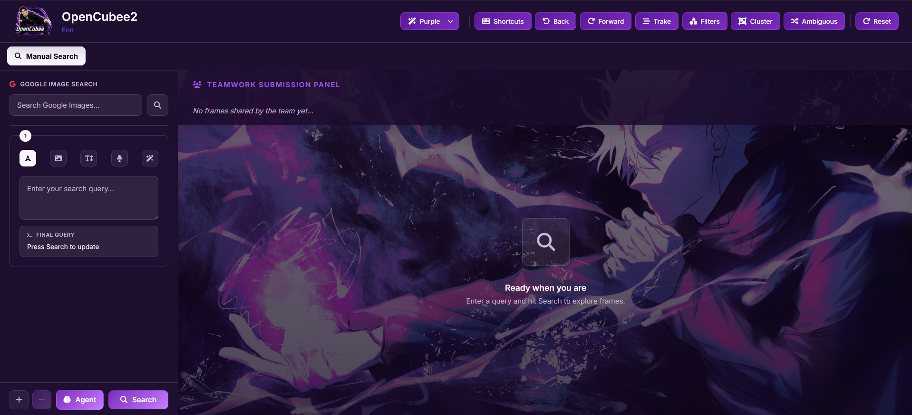

# OpenCubee2 UI

> A high-speed video retrieval cockpit for AIC-style frame hunting, temporal search, agent-assisted reasoning, and team submissions.



OpenCubee2 is a React + Vite + Tailwind command center designed for lightning-fast video search during competitions. It features hybrid queries (text, image, OCR, ASR), temporal stages, WebSocket teamwork syncing, and AI-assisted query enhancement.

---

## 🏆 Cẩm nang Setup Dành Cho Team Thi Đấu (Local + Server AI)

Để đảm bảo tốc độ tải ảnh cực nhanh và không bị sập mạng LAN trong quá trình thi đấu, các thành viên trong team sẽ chạy Web (UI) và lưu trữ Ảnh (Keyframes) trên máy cá nhân, nhưng AI và dữ liệu chat Teamwork sẽ xử lý tập trung trên Server.

Dưới đây là 3 bước cực kỳ đơn giản (Sử dụng Docker Nginx để tối ưu 100% hiệu suất):

### Bước 1: Clone Code & Chuẩn Bị Ảnh (Keyframes)
1. Mở Terminal, clone toàn bộ code `opencubee2-ui` về máy cá nhân của bạn.
2. Copy toàn bộ ảnh Keyframes (các file `.webp`) của ban tổ chức vào đúng thư mục này:
   👉 `opencubee2-ui/public/keyframes/`
   *(Lưu ý: Không tạo thêm thư mục con, cứ ném thẳng tất cả ảnh vào đây)*

### Bước 2: Tạo đường hầm kết nối tới Server (SSH Tunnel)
Vì máy chủ AI (GuestNAS) có thể chặn kết nối từ bên ngoài (Tường lửa), bạn cần đào một đường hầm để kết nối an toàn.
Mở 1 Terminal mới trên máy cá nhân và gõ lệnh sau (cứ để nó chạy ngầm, đừng tắt):
```bash
ssh -L 21081:localhost:2108 nguyenmv@192.168.20.156
```

### Bước 3: Cấu hình và Chạy Web bằng Docker
1. Ngay tại thư mục gốc `opencubee2-ui`, tạo một file có tên là **`.env`** với nội dung sau:
   ```env
   # Trỏ API và WebSocket vào đường hầm SSH vừa tạo ở trên
   VITE_BACKEND_BASE_URL=http://localhost:21081
   
   # Load ảnh trực tiếp từ Nginx nội bộ
   VITE_ASSET_BASE_URL=/keyframes
   ```
2. Mở một Terminal khác ở thư mục này, gõ lệnh khởi động Docker:
   ```bash
   docker compose up --build
   ```
3. Xong! Mở trình duyệt Chrome lên và truy cập **`http://localhost:21080`**.

> **💡 Tại sao lại dùng Docker Nginx?** Thư mục `public/keyframes` chứa hàng trăm ngàn tấm ảnh sẽ làm sập NodeJS (Vite) nếu chạy bằng `npm run dev` thông thường. Docker đã được tối ưu để bỏ qua thư mục này lúc build và dùng Volume để Nginx load trực tiếp, giúp web chạy ở tốc độ cao nhất!

---

*(Dành riêng cho Quản trị viên Host)*
## ⚙️ Setup Guide for the Central Server (GuestNAS)

Nếu bạn muốn build bản Production và chạy UI trực tiếp trên Server:
```bash
npm install
npm run build
npx serve -s dist -l 2208
```
Và đảm bảo Backend FastAPI đang chạy (ở thư mục `Opencubee2/backend`):
```bash
uvicorn main:app --host 0.0.0.0 --port 2108 --workers 1
```

---

## 🎮 Power Controls & Shortcuts

| Action | Shortcut / Gesture |
| --- | --- |
| Search from a stage | `Enter` |
| Toggle enhance | `Ctrl + E` |
| Search history back / forward | `Ctrl + Left` / `Ctrl + Right` |
| Browser-style restore | `Alt + Left` / `Alt + Right` |
| Toggle OCR | `Alt + T` |
| Toggle ASR | `Alt + Y` |
| Toggle text/image mode | `Alt + I` |
| Add / remove stage | `Alt + +` / `Alt + -` |
| Reset workspace | `Alt + R` |
| Push hovered frame to team | `Ctrl + Space` |
| Open frame context | `Ctrl` / `Cmd` click |
| Quick image search from frame| `Ctrl` / `Cmd` + `Shift` click |
| Lock a video | `Alt` click |
| Preview video | right click a frame |

---

## 🌊 Search Flow

1. Enter a text query or switch a stage to image mode.
2. Add OCR and ASR constraints when the target moment has visible text or spoken words.
3. Add more stages for temporal search.
4. Toggle cluster or ambiguous mode when the hunt calls for it.
5. Hit Search, inspect frames, open context, preview video, or push candidates to Teamwork.
6. Launch Agent Search when you want an autonomous pass with logs and candidate reasoning.
